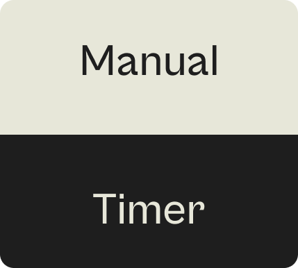
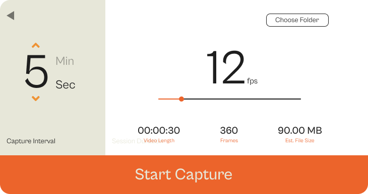
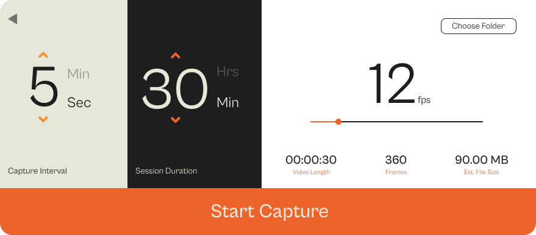
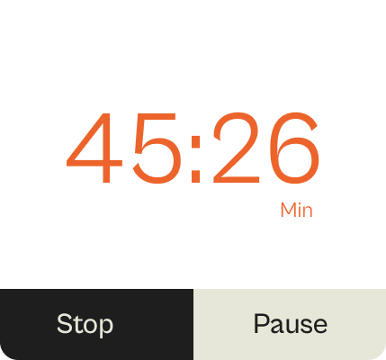
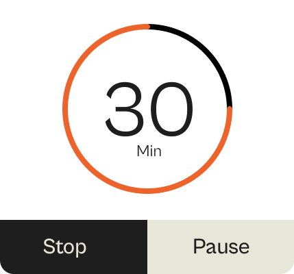

<p align="center">
  
</p>

# Trace 🕒
### *The Ultimate Desktop Timelapse Utility*

Trace is a premium, open-source desktop application designed for creatives and professionals who want to capture their work process in stunning timelapse videos. Built with Electron and React, Trace offers a seamless, high-performance experience with granular control over capture intervals, playback speed, and output quality.

---

## ✨ Key Features

### 🛠️ Professional Capture Engine
- **Granular Intervals**: Set your capture frequency from 1 second to several hours.
- **Session Modes**: Choose between **Infinite Mode** for ongoing work or **Session Duration** for timed projects.
- **Smart Estimates**: Real-time calculation of frame count, video duration, and estimated file size *before* you start.

### 🎥 High-Fidelity Export
- **FPS Control**: Export your timelapses at any speed from 1 to 60 FPS.
- **MP4 Encoding**: Automatic conversion using FFmpeg for maximum compatibility.
- **Sleep Prevention**: Built-in logic to keep your system awake during long capture sessions.

### 🎨 Modern Interface
- **Glassmorphism Design**: A sleek, dark-mode-first UI that stays out of your way.
- **Real-time Feedback**: Visual progress indicators and live session stats.

---

## 📸 Interface Showcase

| Mode Selection | Setup (Intervals) | Setup (Duration) |
| :---: | :---: | :---: |
|  |  |  |

| Active Session (Timer) | Active Session (Circular) |
| :---: | :---: |
|  |  |

---

## 🚀 Getting Started

### Prerequisites
- [Node.js](https://nodejs.org/) (LTS recommended)
- [FFmpeg](https://ffmpeg.org/) (Automatically bundled in builds, but needed for dev)

### Installation
1. Clone the repository:
   ```bash
   git clone https://github.com/shresthkushwaha/Trace-Timelapse.git
   cd Trace-Timelapse
   ```
2. Install dependencies:
   ```bash
   npm install
   ```

### Development
Launch the application with live reloading:
```bash
npm run electron:dev
```

### Building for Production
Create a standalone installer for Windows:
```bash
npm run dist
```

---

## 🛠️ Tech Stack

- **Framework**: [Electron](https://www.electronjs.org/)
- **UI**: [React](https://reactjs.org/) + [Tailwind CSS](https://tailwindcss.com/)
- **Animations**: [Framer Motion](https://www.framer.com/motion/)
- **Build Tool**: [Vite](https://vitejs.dev/)
- **Processing**: [FFmpeg](https://ffmpeg.org/) (via `fluent-ffmpeg`)
- **System**: [Screenshot Desktop](https://www.npmjs.com/package/screenshot-desktop)

---

## 📜 License

Distributed under the MIT License. See `LICENSE` for more information.

---

<p align="center">
  Built with ❤️ by Shresth Kushwaha
</p>
